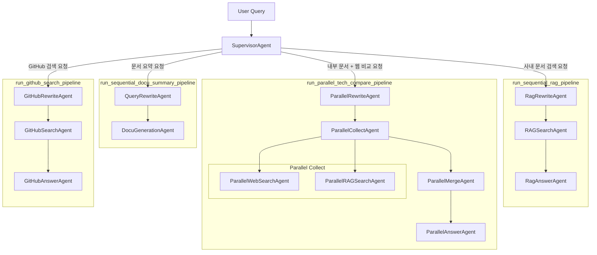

# ADK Internal Knowledge Agent

Google ADK 기반 멀티에이전트 CLI 프로젝트다. 사용자의 질문을 보고 적절한 파이프라인으로 라우팅한 뒤, 사내 문서 검색, 웹 검색 비교, GitHub 검색, 업로드 문서 요약을 수행한다.

## 핵심 기능

- Vertex AI Search(Data Store)를 이용한 사내 문서 검색
- Vertex RAG corpus와 Google Search를 병렬로 호출하는 기술 비교 응답
- GitHub MCP 서버를 통한 저장소, 이슈, PR, 사용자 정보 검색
- 업로드된 아티팩트를 읽어 문서 요약 생성
- SupervisorAgent 기반 요청 분류와 순차/병렬 워크플로우 실행
- Vertex AI session service 기반 대화 세션 유지

## 동작 구조

루트 에이전트는 `SupervisorAgent`이며, 사용자 요청을 아래 네 개 파이프라인 중 하나로 보낸다.

1. `run_sequential_docu_summary_pipeline`
   첨부 파일이나 긴 본문을 요약할 때 사용
2. `run_sequential_rag_pipeline`
   사내 문서나 내부 기술 자료를 찾을 때 사용
3. `run_parallel_tech_compare_pipeline`
   내부 문서와 외부 웹 정보를 함께 비교할 때 사용
4. `run_github_search_pipeline`
   GitHub 저장소, 코드, 이슈, PR, 커밋 관련 질문일 때 사용

흐름 요약:

```text
User
  -> SupervisorAgent
     -> 문서 요약 파이프라인
     -> 사내 문서 검색 파이프라인
     -> 병렬 비교 파이프라인
     -> GitHub 검색 파이프라인
```

## 에이전트 구조



## 파이프라인 상세

### 1. 문서 요약 파이프라인

- `QueryRewriteAgent`
- `DocuGenerationAgent`

`DocuGenerationAgent`는 `artifact_read_tool`을 통해 업로드된 파일을 읽고 요약을 만든다.

### 2. 사내 문서 검색 파이프라인

- `RagRewriteAgent`
- `RAGSearchAgent`
- `RagAnswerAgent`

`RAGSearchAgent`는 `search_datastore()`를 호출해 Vertex AI Search(Data Store)에서 문서를 찾는다. 현재 필터에서 사용하는 허용 필드는 `doc_type`, `doc_category`, `doc_title`이다.

### 3. 병렬 기술 비교 파이프라인

- `ParallelRewriteAgent`
- `ParallelCollectAgent`
  - `ParallelWebSearchAgent`
  - `ParallelRAGSearchAgent`
- `ParallelMergeAgent`
- `ParallelAnswerAgent`

웹 검색은 `google_search`, 내부 검색은 `search_vertex_rag()`를 사용한다.

### 4. GitHub 검색 파이프라인

- `GitHubRewriteAgent`
- `GitHubSearchAgent`
- `GitHubAnswerAgent`

GitHub 검색은 MCP 서버를 stdio 방식으로 연결해 수행한다.

## 프로젝트 구조

```text
.
├── agent.py
├── main.py
├── app/
│   ├── agent/
│   │   ├── root.py
│   │   ├── sub_agents.py
│   │   └── workflows.py
│   ├── config/
│   │   ├── mcp_servers.example.json
│   │   └── settings.py
│   ├── mcp/
│   │   └── toolsets.py
│   ├── prompt/
│   │   └── instructions.py
│   ├── scripts/
│   │   └── create_agent_engine.py
│   ├── services/
│   │   ├── chat_cli.py
│   │   └── runtime_logging.py
│   ├── tool/
│   │   └── callbacks.py
│   └── util/
│       └── tool.py
├── allowed_dir/
├── secrets/
├── pyproject.toml
└── uv.lock
```

주요 파일:

- [main.py]: CLI 진입점
- [agent.py]: 외부 export용 루트 에이전트
- [root.py]: `SupervisorAgent` 정의
- [workflows.py]: 순차/병렬 파이프라인 구성
- [sub_agents.py]: 개별 LLM 에이전트 팩토리
- [instructions.py]: 각 에이전트 프롬프트
- [tool.py]: Vertex 검색 및 artifact 도구
- [toolsets.py]: GitHub MCP toolset 연결
- [chat_cli.py]: Runner 및 세션 초기화, CLI 루프
- [callbacks.py]: 라우팅 보조, 출력 정규화, 보안성 검사

## 요구 사항

- Python 3.13 이상
- `uv`
- Google Cloud 프로젝트
- Vertex AI 사용 가능한 인증
- GitHub MCP 서버 실행 파일 또는 커맨드 경로
- GitHub 검색을 사용할 경우 GitHub Personal Access Token

## 설치

```bash
uv sync
```

가상환경 활성화 예시:

```bash
source .venv/bin/activate
```

## 환경 변수

[settings.py] 기준으로 아래 값들을 사용한다.

필수에 가까운 값:

- `GOOGLE_CLOUD_PROJECT`
- `GOOGLE_CLOUD_LOCATION`
- `REASONING_ENGINE_APP_NAME`
- `REASONING_ENGINE_ID`
- `DISCOVERY_ENGINE_LOCATION`
- `DISCOVERY_ENGINE_ENGINE_ID`

기능별 추가 값:

- `VERTEX_RAG_LOCATION`
- `VERTEX_RAG_CORPUS`
- `GITHUB_MCP_SERVER_PATH`
- `GITHUB_PERSONAL_ACCESS_TOKEN`
- `MODEL_GEMINI_2_5_FLASH`

인증은 일반적으로 아래 둘 중 하나를 사용한다.

- `gcloud auth application-default login`
- `GOOGLE_APPLICATION_CREDENTIALS=/absolute/path/to/service-account.json`

예시:

```env
GOOGLE_CLOUD_PROJECT=your-gcp-project
GOOGLE_CLOUD_LOCATION=us-central1

REASONING_ENGINE_APP_NAME=your-app-name
REASONING_ENGINE_ID=projects/PROJECT/locations/LOCATION/reasoningEngines/ID

DISCOVERY_ENGINE_LOCATION=global
DISCOVERY_ENGINE_ENGINE_ID=your-discovery-engine-id

VERTEX_RAG_LOCATION=asia-northeast3
VERTEX_RAG_CORPUS=projects/PROJECT/locations/LOCATION/ragCorpora/CORPUS_ID

GITHUB_MCP_SERVER_PATH=/absolute/path/to/github-mcp-server
GITHUB_PERSONAL_ACCESS_TOKEN=ghp_xxx


MODEL_GEMINI_2_5_FLASH=gemini-2.5-flash
```

## Agent Engine 생성

`REASONING_ENGINE_ID`가 없다면 아래 스크립트로 Agent Engine을 만들 수 있다.

```bash
python app/scripts/create_agent_engine.py
```

출력된 리소스 이름을 `.env`의 `REASONING_ENGINE_ID`에 넣으면 된다.

## 실행

CLI 실행:

```bash
python main.py
```

실행 시:

- Vertex AI 세션이 생성된다
- 함수 호출 로그가 터미널에 출력된다
- `exit` 또는 `quit` 입력 시 종료된다

## 예시 질문

- `사내 문서에서 AgentBuilder 매뉴얼 찾아줘`
- `사내 AgentBuilder 구조랑 최신 Agent사례 웹에서 찾고 비교해줘`
- `이 저장소 관련 PR 흐름 알려줘`
- `업로드한 문서 요약해줘`

## 구현 메모

- 사내 문서 검색은 `search_datastore()`를 사용한다.
- RAG 검색용 `filter_expr`에서는 현재 `tags` 필드를 사용하지 않는다.
- GitHub 검색은 [toolsets.py]의 stdio MCP 연결에 의존한다.
- CLI 세션은 [chat_cli.py]에서 `VertexAiSessionService`로 관리한다.

## 제한 사항

- GitHub MCP 서버 경로가 올바르지 않으면 GitHub 파이프라인은 동작하지 않는다.
- Discovery Engine 또는 Vertex RAG 리소스가 준비되지 않으면 내부 문서 검색 파이프라인은 실패한다.
- 문서 업로드 요약은 ADK artifact 흐름에 의존하므로, CLI 사용 방식에 따라 별도 업로드 처리 구성이 필요할 수 있다.
