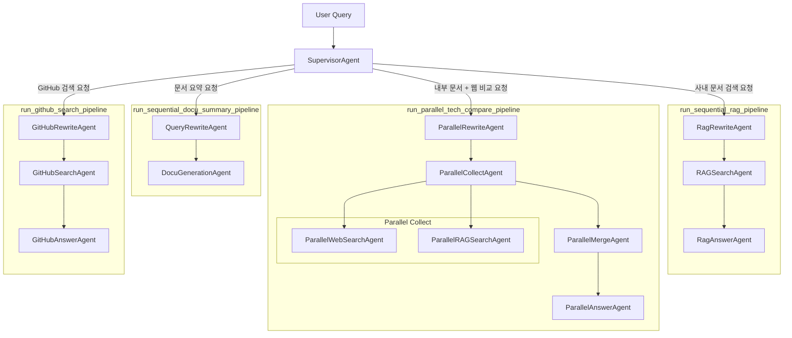

# ADK RAG Assistant

Google ADK 기반 멀티 에이전트 프로젝트다. 하나의 Supervisor Agent가 사용자 요청을 분류하고, 사내 문서 검색, 내부/외부 정보 비교, GitHub 조회, 업로드 문서 요약 중 알맞은 파이프라인으로 라우팅한다.

현재 저장소에는 아래 구성이 함께 들어 있다.

- Python 기반 ADK 에이전트 및 FastAPI 서버
- React + Vite 기반 채팅 UI
- Dockerfile 및 Cloud Build 배포 설정

## 주요 기능

- Vertex AI Search(Data Store) 기반 사내 문서 검색
- Vertex RAG corpus + 웹 검색 병렬 비교 응답
- GitHub MCP 서버를 통한 저장소/이슈/PR/사용자 조회
- 업로드된 파일 아티팩트 요약
- 세션 기반 대화 유지
- FastAPI API + 브라우저 UI 제공

## 아키텍처

```text
User
  -> SupervisorAgent
     -> 문서 요약 파이프라인
     -> 사내 문서 검색 파이프라인
     -> 내부/외부 비교 파이프라인
     -> GitHub 검색 파이프라인
```

## 에이전트 구조



### 1. 문서 요약 파이프라인

- `QueryRewriteAgent`
- `DocuGenerationAgent`

업로드된 아티팩트를 읽어 핵심 내용을 요약한다.

### 2. 사내 문서 검색 파이프라인

- `RagRewriteAgent`
- `RAGSearchAgent`
- `RagAnswerAgent`

Vertex AI Search(Data Store)를 사용한다. 검색 필터는 현재 `doc_type`, `doc_category`, `doc_title` 기준으로 생성된다.

### 3. 내부/외부 비교 파이프라인

- `ParallelRewriteAgent`
- `ParallelCollectAgent`
  - `ParallelWebSearchAgent`
  - `ParallelRAGSearchAgent`
- `ParallelMergeAgent`
- `ParallelAnswerAgent`

사내 RAG 결과와 웹 검색 결과를 동시에 수집한 뒤, 충돌 여부를 포함해 병합 응답을 만든다.

### 4. GitHub 검색 파이프라인

- `GitHubRewriteAgent`
- `GitHubSearchAgent`
- `GitHubAnswerAgent`

GitHub MCP 서버를 `stdio` 방식으로 연결해 읽기 전용 조회를 수행한다.

## 프로젝트 구조

```text
.
├── agent.py
├── main.py
├── app/
│   ├── agent/
│   │   ├── root.py
│   │   ├── sub_agents.py
│   │   └── workflows.py
│   ├── api/
│   │   ├── executor.py
│   │   ├── main.py
│   │   ├── routes/
│   │   └── schemas/
│   ├── config/
│   │   ├── mcp_servers.example.json
│   │   └── settings.py
│   ├── mcp/
│   │   └── toolsets.py
│   ├── prompt/
│   │   └── instructions.py
│   ├── services/
│   │   ├── chat_cli.py
│   │   └── runtime_logging.py
│   ├── tool/
│   │   └── callbacks.py
│   └── util/
│       └── tool.py
├── ui/
│   ├── src/
│   └── package.json
├── Dockerfile
├── cloudbuild.yaml
├── env-sample
├── pyproject.toml
└── uv.lock
```

## 기술 스택

### Backend

- Python 3.13
- Google ADK
- FastAPI
- Vertex AI / Vertex AI Search / Vertex RAG
- MCP

### Frontend

- React 19
- TypeScript
- Vite

## 요구 사항

- Python 3.13 이상
- `uv`
- Node.js 20 이상
- npm
- Google Cloud 프로젝트 및 인증

선택 사항:

- GitHub MCP 서버 실행 파일
- GitHub Personal Access Token

## 설치

### 1. Python 의존성 설치

```bash
uv sync
```

### 2. UI 의존성 설치

```bash
cd ui
npm install
```

### 3. 환경 변수 파일 준비

```bash
cp env-sample .env
```

## 환경 변수

주요 항목은 아래와 같다.

### 공통

- `MODEL_GEMINI_2_5_FLASH`
- `GOOGLE_CLOUD_PROJECT`
- `GOOGLE_CLOUD_LOCATION`
- `GOOGLE_GENAI_USE_VERTEXAI`

### Reasoning Engine / 세션

- `REASONING_ENGINE_APP_NAME`
- `REASONING_ENGINE_ID`
- `REASONING_ENGINE_LOCATION`

`REASONING_ENGINE_APP_NAME`이 설정되면 API 실행기는 Vertex AI Session Service를 사용하고, 비어 있으면 메모리 세션을 사용한다.

### RAG / 검색

- `VERTEX_RAG_LOCATION`
- `VERTEX_RAG_CORPUS`
- `DISCOVERY_ENGINE_ENGINE_ID`
- `DISCOVERY_ENGINE_LOCATION`

### GitHub MCP

- `GITHUB_MCP_SERVER_PATH`
- `GITHUB_PERSONAL_ACCESS_TOKEN`
- `GITHUB_DEFAULT_REPOSITORY`

### API 서버

- `API_HOST`
- `API_PORT`
- `UVICORN_WORKERS`
- `ALLOWED_ORIGINS`
- `API_KEY`
- `LOG_LEVEL`
- `ENV`

### 기타

- `FILESYSTEM_ALLOWED_DIR`

문서 요약 시 로컬 파일 시스템 접근 범위를 제한하는 용도다.

## 인증

Google Cloud 인증은 일반적으로 아래 둘 중 하나로 맞춘다.

- `gcloud auth application-default login`
- 서비스 계정 키 파일을 사용한 `GOOGLE_APPLICATION_CREDENTIALS` 설정

## 실행 방법

### 1. CLI 실행

```bash
uv run python main.py
```

대화형 CLI가 실행되며 `exit` 또는 `quit`으로 종료할 수 있다.

### 2. API 서버 실행

```bash
uv run python -m app.api.main
```

기본 포트는 `8080`이다.

주요 엔드포인트:

- `GET /healthz`
- `POST /v1/query`

요청 예시:

```json
{
  "query": "AgentBuilder 관련 사내 문서 찾아줘",
  "session_id": null
}
```

`API_KEY`가 설정된 환경에서는 `X-API-Key` 헤더가 필요하다.

### 3. UI 개발 서버 실행

```bash
cd ui
npm run dev
```

필요하면 `.env` 또는 프런트엔드 환경 파일에 `VITE_API_BASE_URL`을 설정해 API 주소를 지정한다. 값이 비어 있으면 same-origin으로 요청한다.

### 4. UI 빌드

```bash
cd ui
npm run build
```

UI를 빌드하면 `ui/dist`가 생성되고, API 서버는 이 디렉터리가 존재할 때 정적 파일을 함께 서빙한다.

## Docker

멀티 스테이지 Docker 빌드를 사용한다.

- 1단계: Node 환경에서 UI 빌드
- 2단계: `uv`로 Python 의존성 설치
- 3단계: 런타임 이미지에서 FastAPI + 정적 UI 제공

이미지 실행 커맨드는 `uvicorn app.api.main:app --host 0.0.0.0 --port 8080`이다.

## 배포

`cloudbuild.yaml`은 아래 흐름을 기준으로 작성되어 있다.

1. Docker 이미지 빌드
2. Artifact Registry 푸시
3. Cloud Run 배포
4. `/healthz` 및 `/` 스모크 테스트

기본 배포 대상은 Cloud Run이며, 주요 GCP 관련 환경 변수를 배포 시 주입하도록 되어 있다.

## 현재 구현 기준 동작 메모

- 루트 에이전트는 `SupervisorAgent` 하나다.
- API는 `POST /v1/query`에서 최종 답변과 세션 ID를 반환한다.
- 응답의 `citations`는 현재 빈 배열로 내려간다.
- UI는 대화 히스토리를 브라우저 `localStorage`에 저장한다.
- GitHub 검색은 읽기 전용 MCP 도구 설정으로 연결된다.

## 개발 시 참고

- 기존 `ui/README.md`는 Vite 기본 템플릿 문서라서 실제 프로젝트 설명과 다르다.
- 저장소에 포함된 `.env` 값은 배포 또는 로컬 환경에 맞게 다시 확인해야 한다.
- 현재 Git 작업 트리에 사용자 변경 사항이 있을 수 있으므로 문서 외 파일 수정 시 함께 검토하는 편이 안전하다.
